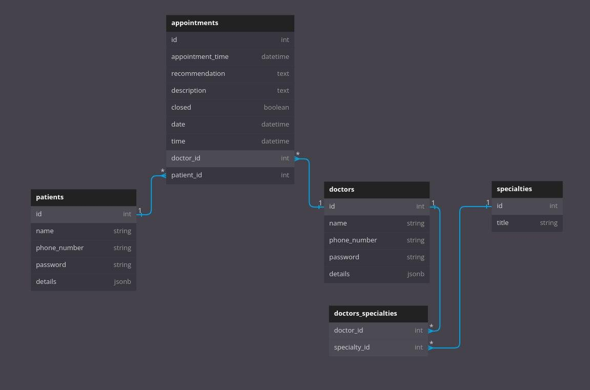

# Simple clinic management app

Visit website: https://enigmatic-lowlands-09671.herokuapp.com/
## DB Schema


## Installation
Follow these easy steps to install and start the app:

### Prerequisites
The setups steps expect following tools installed on the system.

* Github
* Docker

### Check out the repository
```git clone https://github.com/vbiletskiyy/clinic_management.git```

### Open cd
```cd clinic_management```

### Set up and start Rails app with Docker
```docker-compose build```

```docker-compose up```

Use Ctrl-C to stop
## To get an interactive shell with docker-compose run:
```docker-compose run --rm web bash```

Now you can work inside the container as if you were just using Rails and Ruby on your local machine

Install the gems required by the application:

```bundle install```

## Create, setup and seeding the database
```rails db:create```

```rails db:migrate```

```rails db:seed```
## Test
Run ```rspec``` in the terminal
